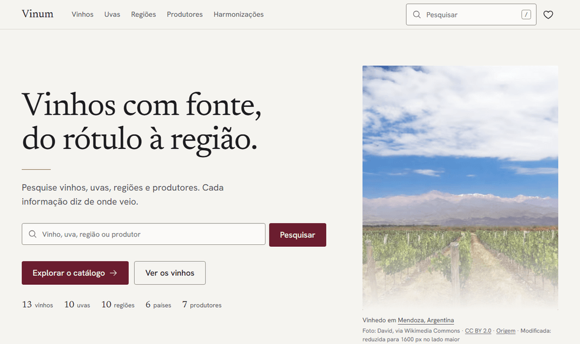
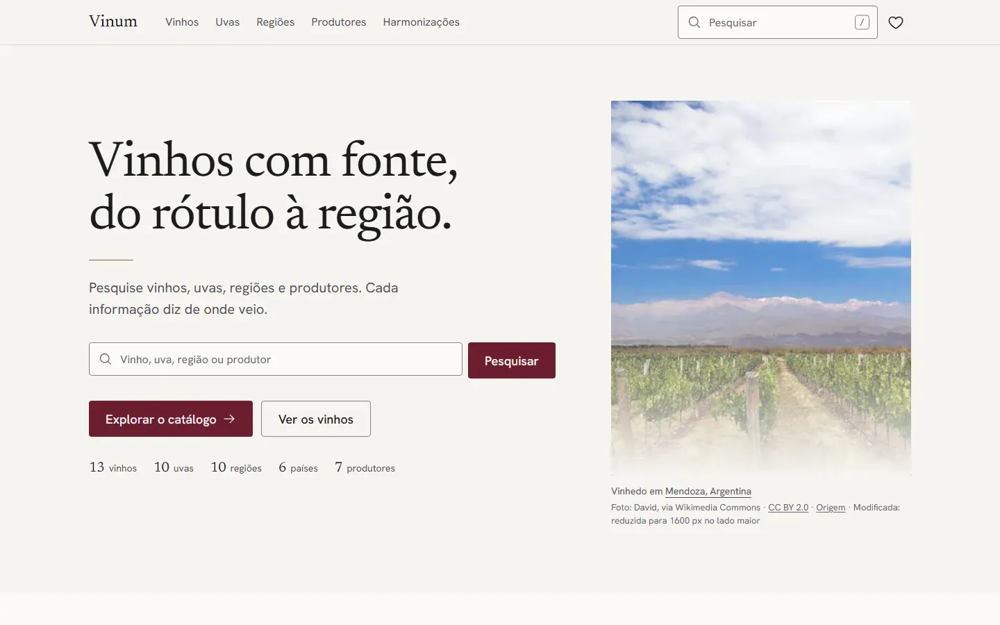
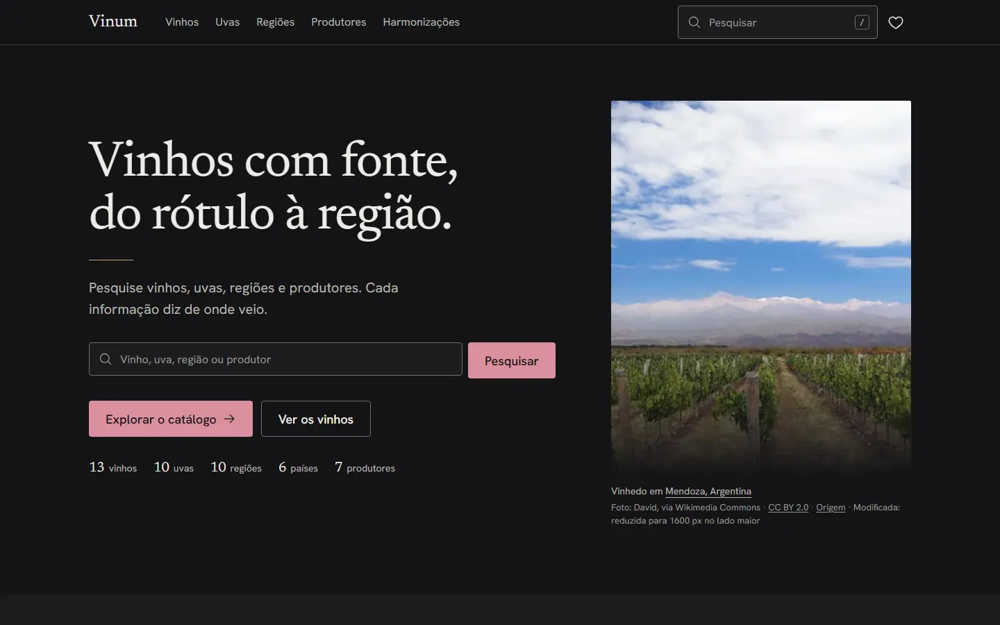
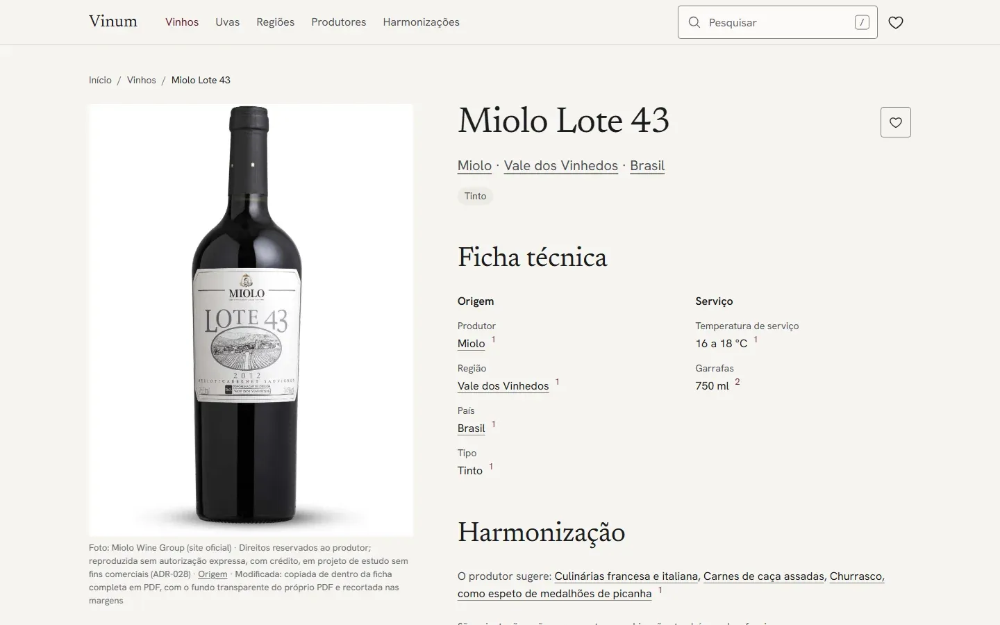
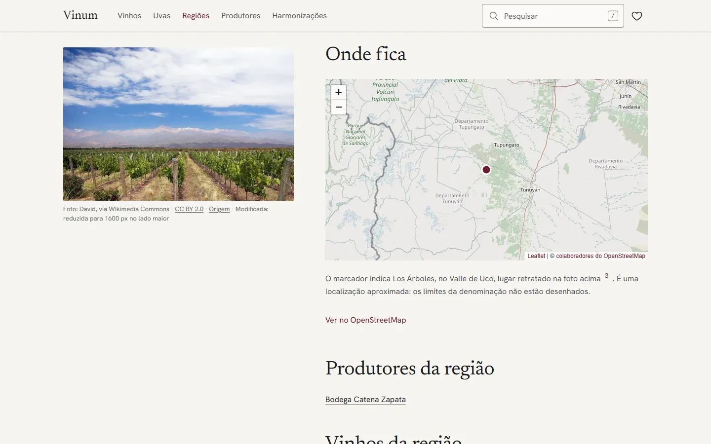
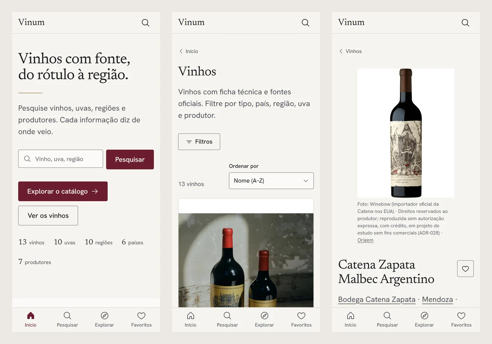
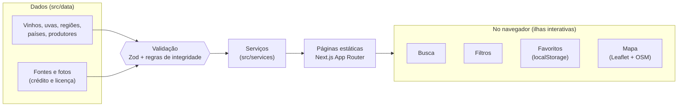

<div align="center">

<picture>
  <source media="(prefers-color-scheme: dark)" srcset=".github/readme/banner-escuro.svg">
  
</picture>

<br>

[](https://github.com/KaioSilva14/Projeto-Pesquisa-Vinhos/actions/workflows/ci.yml)


**Plataforma de pesquisa, descoberta e consulta de vinhos.**<br>
Catálogo premium + enciclopédia moderna, em que **cada informação mostra de onde veio**.

[O que dá para fazer](#o-que-dá-para-fazer) ·
[Telas](#telas) ·
[Princípios](#princípios) ·
[Como funciona](#como-funciona) ·
[Como rodar](#como-rodar) ·
[Documentação](#documentação)

</div>

---

> [!NOTE]
> **Não é loja.** Não há preços, carrinho nem venda, e não é preciso criar conta para usar.
> O Vinum é um **projeto de estudo**, sem fins comerciais e sem publicidade.

<div align="center">
  
  <br>
  <sub>Busca com sugestões enquanto você digita → resultados → página do vinho → fontes citadas.</sub>
</div>

## O que dá para fazer

<table>
  <tr>
    <td width="50%" valign="top">
      <h4>🔎 Pesquisar</h4>
      Busca com sugestões enquanto você digita, que perdoa acentos e pequenos erros
      (<code>malbek</code> encontra Malbec). Atalho <kbd>/</kbd> em qualquer página.
    </td>
    <td width="50%" valign="top">
      <h4>🍷 Consultar vinhos</h4>
      Ficha técnica, safras, uvas e harmonizações sugeridas pelo produtor, com o número da
      fonte ao lado de cada fato.
    </td>
  </tr>
  <tr>
    <td valign="top">
      <h4>🧭 Filtrar o catálogo</h4>
      Tipo, país, região, uva e produtor, combináveis. Os filtros ficam no endereço da
      página: dá para compartilhar e voltar.
    </td>
    <td valign="top">
      <h4>🍇 Conhecer uvas, regiões e produtores</h4>
      Páginas ligadas entre si: da uva para os vinhos, do vinho para a região, da região para
      o país.
    </td>
  </tr>
  <tr>
    <td valign="top">
      <h4>🗺️ Ver no mapa</h4>
      Mapas reais do OpenStreetMap nas regiões e países, carregados só quando você pede.
    </td>
    <td valign="top">
      <h4>❤️ Guardar favoritos</h4>
      Salve vinhos, uvas, regiões e produtores. Fica no seu navegador, sem conta e sem
      enviar nada a ninguém.
    </td>
  </tr>
  <tr>
    <td valign="top">
      <h4>🌓 Tema claro e escuro</h4>
      Segue a preferência do seu sistema. Com "reduzir movimento" ligado, nada se mexe.
    </td>
    <td valign="top">
      <h4>✍️ Sugerir correções</h4>
      Viu um erro? O formulário monta uma sugestão pública no GitHub, com a fonte que confirma.
    </td>
  </tr>
</table>

## Telas

<table>
  <tr>
    <td></td>
    <td></td>
  </tr>
  <tr>
    <td align="center"><sub>Home, tema claro</sub></td>
    <td align="center"><sub>Home, tema escuro</sub></td>
  </tr>
  <tr>
    <td></td>
    <td></td>
  </tr>
  <tr>
    <td align="center"><sub>Página do vinho, com fonte em cada fato</sub></td>
    <td align="center"><sub>Mapa real da região</sub></td>
  </tr>
</table>

<div align="center">
  
  <br>
  <sub>No celular: navegação inferior, filtros em painel deslizante e áreas de toque de 44 px.</sub>
</div>

## Princípios

| | Regra | Na prática |
|---|---|---|
| 1 | **Veracidade acima de tudo** | Nenhuma informação é inventada. Sem fonte confiável, o campo simplesmente não aparece. |
| 2 | **Fonte em cada fato** | Números ao lado dos dados levam à lista de fontes da página, com a data de consulta. |
| 3 | **Imagens reais** | Fotos do próprio vinho, uva ou região, com crédito e licença; sem foto, o aviso honesto "Imagem indisponível". |
| 4 | **Sem e-commerce** | Nada de preço, carrinho ou botão "comprar". |
| 5 | **Para todos** | Mobile-first, navegação completa pelo teclado, contraste WCAG 2.2 AA e respeito a "reduzir movimento". |
| 6 | **Rápido** | Páginas geradas no build; JavaScript só onde há interação; mapa e busca completa carregados sob demanda. |

## Como funciona



Os dados ficam em arquivos TypeScript e passam por uma validação (`npm run validate:data`): fonte citada que não existe, foto pequena demais ou ligação quebrada entre entidades bloqueiam o build. As páginas são geradas no build e só a busca, os filtros, os favoritos e o mapa rodam JavaScript no navegador.

<details>
<summary><b>Tecnologias</b></summary>
<br>

| Camada | Ferramentas |
|---|---|
| Base | Next.js 16 (App Router), React 19, TypeScript estrito |
| Visual | Tailwind CSS 4 com tokens do design system, Radix UI, ícones Phosphor, fontes Newsreader e Hanken Grotesk (OFL) |
| Dados | Zod 4 (validação), arquivos locais tipados, serviços que escondem a origem dos dados |
| Interação | Busca própria (sem dependência), Zustand (favoritos), Leaflet + OpenStreetMap (mapas) |
| Qualidade | Vitest + Testing Library, Playwright (Chromium, Firefox e WebKit, em celular, tablet e desktop), axe (acessibilidade), ESLint, Prettier, GitHub Actions |

Cada dependência tem justificativa em [`docs/ARCHITECTURE.md`](docs/ARCHITECTURE.md) e cada decisão importante, em [`docs/DECISIONS.md`](docs/DECISIONS.md).

</details>

<details>
<summary><b>Estrutura de pastas</b></summary>
<br>

```text
src/
├─ app/          rotas (vinhos, uvas, regiões, países, produtores, pesquisa, favoritos…)
├─ components/   interface: ui (design system), layout, wine, search, maps, favorites…
├─ data/         catálogo real, com fontes e créditos das fotos
├─ schemas/      tipos e validação (Zod)
├─ services/     acesso aos dados usado pelas páginas
├─ lib/          busca, filtros, SEO, citações, formatação
└─ styles/       tokens de cor, tipografia e animações
docs/            especificação, decisões, tarefas e políticas do projeto
tests/           unitários, componentes e E2E
```

</details>

## Como rodar

**Pré-requisitos:** [Node.js](https://nodejs.org/) 24 LTS (o npm vem junto) e [Git](https://git-scm.com/). Os comandos são para o **PowerShell**, dentro da pasta do projeto (no VS Code: menu *Terminal → Novo Terminal*).

```powershell
npm install                          # 1. baixa as bibliotecas para a pasta node_modules
Copy-Item .env.example .env.local    # 2. cria o arquivo de configuração local (não vai para o Git)
npm run dev                          # 3. abre o site em http://localhost:3000 (Ctrl + C para parar)
```

<details>
<summary><b>Verificar a qualidade</b></summary>
<br>

```powershell
npm run lint           # procura problemas no código (ESLint)
npm run typecheck      # confere os tipos do TypeScript sem gerar arquivos
npm run format:check   # confere se o código está formatado (Prettier)
npm run format         # formata todo o código automaticamente
npm run validate:data  # confere fontes, ligações entre entidades, fotos e dados de demonstração
npm run test           # testes unitários e de componentes (Vitest)
npm run test:e2e       # faz o build e roda os testes no navegador (Playwright + axe)
```

Na primeira vez que for rodar os testes E2E, baixe os navegadores do Playwright:

```powershell
npx playwright install
```

Rode `validate:data` sempre que mexer em `src/data/`: o CI também roda, e um erro bloqueia o PR.

</details>

<details>
<summary><b>Versão de produção</b></summary>
<br>

```powershell
npm run build   # gera o site otimizado
npm run start   # serve essa versão em http://localhost:3000
```

Use `build` + `start` para medir performance (Lighthouse): o modo `dev` é mais lento de propósito.

</details>

<details>
<summary><b>Problemas comuns no Windows</b></summary>
<br>

| Sintoma | Causa provável | Solução |
|---|---|---|
| `EPERM` / `EBUSY` ao instalar ou compilar | OneDrive sincronizando `node_modules` | Mover o projeto para `C:\dev\` (ADR-016) |
| "execução de scripts foi desabilitada neste sistema" | Política de execução do PowerShell | `Set-ExecutionPolicy -Scope CurrentUser RemoteSigned` (uma vez) |
| Porta 3000 em uso | Outro servidor aberto | Fechar o outro terminal ou `npm run dev -- -p 3001` |

Extensões recomendadas do VS Code: **ESLint**, **Prettier**, **Tailwind CSS IntelliSense**, **EditorConfig** e **Playwright Test**.

</details>

## Situação

| Fase | | Fase | |
|---|---|---|---|
| 0 · Documentação | ✅ | 6 · Favoritos | ✅ |
| 1 · Fundação e design system | ✅ | 7 · Animações | ✅ |
| 2 · Dados e serviços | ✅ | 8 · 3D | ⏭️ testado e removido ([ADR-032](docs/DECISIONS.md)) |
| 3 · Busca e catálogo | ✅ | 9 · Mapas | ✅ |
| 4 · Páginas de vinho, uva, região, país e produtor | ✅ | 10 · Auditorias (acessibilidade, performance, segurança) | 🔄 em andamento |
| 5 · Home e narrativa | ✅ | 11 · Publicação | ⏳ |

Estado detalhado e próximos passos: [`docs/MEMORY.md`](docs/MEMORY.md) e [`docs/TASKS.md`](docs/TASKS.md).

## Documentação

Toda a documentação está em [`docs/`](docs/). O [`CLAUDE.md`](CLAUDE.md), na raiz, é a especificação original do produto.

| Documento | Para que serve |
|---|---|
| [PRD](docs/PRD.md) | O que vamos construir e por quê |
| [ARCHITECTURE](docs/ARCHITECTURE.md) | Stack, pastas, fluxo de dados, riscos |
| [DESIGN](docs/DESIGN.md) | Design system: cores, tipografia, componentes |
| [RULES](docs/RULES.md) | Regras de código e de conteúdo |
| [TASKS](docs/TASKS.md) · [MEMORY](docs/MEMORY.md) | Tarefas e estado atual |
| [DECISIONS](docs/DECISIONS.md) | Decisões técnicas e de produto (ADRs) |
| [DATA_MODEL](docs/DATA_MODEL.md) · [DATA_SOURCES](docs/DATA_SOURCES.md) · [IMAGES](docs/IMAGES.md) · [CURATION](docs/CURATION.md) | Dados, fontes, imagens e catálogo |
| [SEO](docs/SEO.md) · [SECURITY](docs/SECURITY.md) · [ACCESSIBILITY](docs/ACCESSIBILITY.md) · [PERFORMANCE](docs/PERFORMANCE.md) · [ANIMATIONS](docs/ANIMATIONS.md) · [TESTING](docs/TESTING.md) | Requisitos de qualidade |
| [CHANGELOG](docs/CHANGELOG.md) | Histórico de mudanças |

## Créditos e direitos

As fotos pertencem aos seus autores e instituições (Wikimedia Commons, VIVC/JKI, INV e sites oficiais dos produtores e importadores) e **não estão cobertas por nenhuma licença deste repositório**. Os créditos completos estão em [`public/images/CREDITOS.md`](public/images/CREDITOS.md) e na página *Sobre* do site. Se você é detentor de direitos de alguma imagem e deseja a remoção, [abra uma issue](https://github.com/KaioSilva14/Projeto-Pesquisa-Vinhos/issues).

Mapas: © colaboradores do [OpenStreetMap](https://www.openstreetmap.org/copyright). Fontes Newsreader e Hanken Grotesk: SIL Open Font License.

---

<div align="center">
<sub>🔞 Bebidas alcoólicas são proibidas para menores de 18 anos. Se beber, faça com moderação e não dirija.</sub>
</div>
